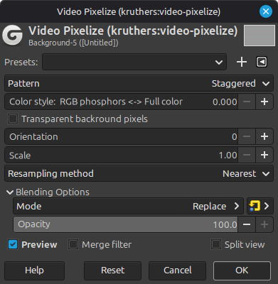
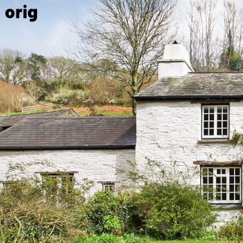
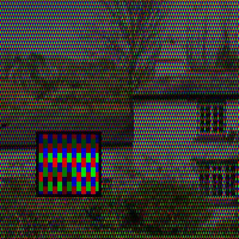
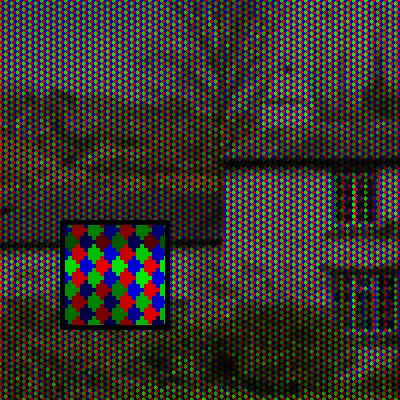
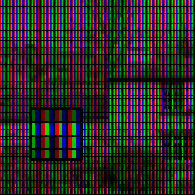
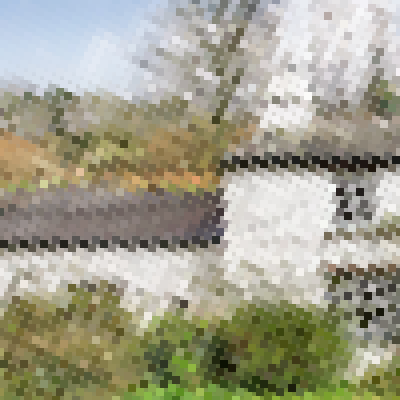

# Video Pixelize GIMP filter

**Video Pixelize** is a non-destructive Gimp GEGL filter.  It creates
a blocky pixel effect that looks like old CRT or LCD subpixels.
It's similar to the **Pixelize** effect except the resulting "video
pixels" are not laid out in a cartesian grid; there are many patterns
to choose from.  And it's similar to the **Video Degradation** effect
except that the resulting video pixels are blocky and solid colors .
There are also many knobs to tweak.

## UI and Example screenshots

  
 
  

The last example uses the `Square pinwheel` pattern, scale of 4.0,
`Transparent Background Pixels` checked, and is layered over an blurred
copy of the original image.

## Usage example
Download to view (embed not working):
[example-usage.mp4](screenshots/example-usage.mp4) 

## Bugs
1. The `Transparent Background Pixels` checkbox will not really work
if the layer has no alpha channel.  It will *appear* to work, but some
operations (including exporting an image) will still show black instead
of seeing through to lower layers.
2. At some high scale values there are visible glitches on the bottom
edge. This appears to be a bug in GEGL (which I've reported).  If I'm
wrong, or if I'm right but GEGL maintainers don't handle it, I don't
really have any idea how to fix it.

## Installing

TODO
